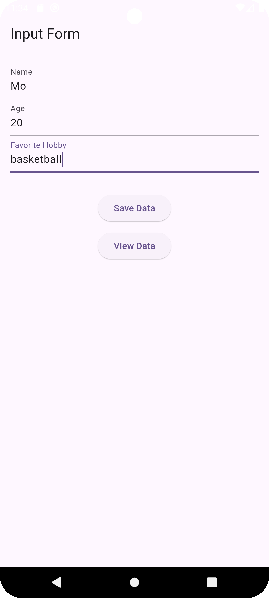
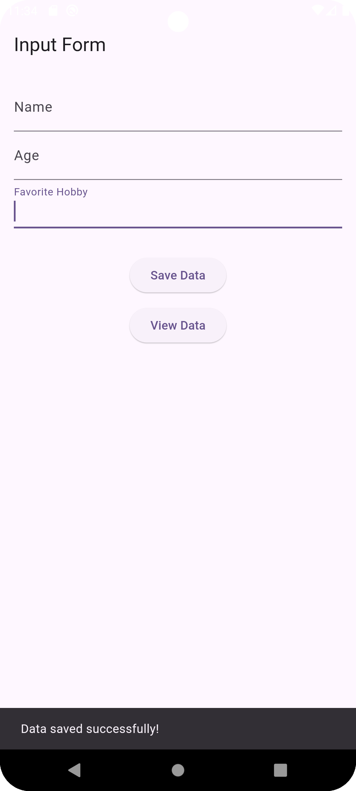
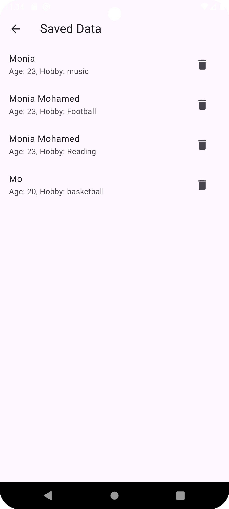

# Firestore User Info

A simple Flutter application for managing user data using Firebase Firestore. The app allows adding,
viewing, and deleting users.

## Features

- **Input Form**: Allows users to enter their name, age, and hobby, and save it to Firestore.
- **View Data**: Displays a list of users saved in Firestore.
- **Delete Data**: Enables users to delete their records from Firestore.

## How to Use

### 1. Add a User

- Open the app.
- Fill in the fields:
    - **Name**: Enter the user's name.
    - **Age**: Enter the user's age.
    - **Favorite Hobby**: Enter the user's hobby.
- Press the **Save Data** button to save the data.

### 2. View Data

- Press the **View Data** button to see a list of saved users.
- The list will display the name, age, and hobby of each user.

### 3. Delete a User

- On the data display screen, press the delete icon (🗑️) next to the user you want to delete.
- Confirm the deletion in the dialog box.

## Code Structure

### 1. `input_form.dart`

This file contains the `InputForm` widget, which allows users to input their data and save it to
Firestore.

### 2. `display_data.dart`

This file contains the `DisplayData` widget, which retrieves and displays the saved user data from
Firestore.

### 3. `user_firebase_model.dart`

This file defines the `UserFirebaseModel` class, which represents the user data and contains methods
to convert the data to and from Firestore.

### 4. `user_firebase_services.dart`

This file contains the `UserFirebaseServices` class, which manages interactions with Firestore,
including adding, retrieving, and deleting user data.

## Screenshots

| Add User                              | Save Date                          | Display Data                             | 
|---------------------------------------|------------------------------------|------------------------------------------|
|  |  |  | 
|

---

## Requirements

- Flutter 3.x or higher
- Firebase project setup with Firestore enabled
- Add Firebase dependencies to your `pubspec.yaml`

## Setup

### 1. Create a Firebase Project

1. Go to the [Firebase Console](https://console.firebase.google.com/).
2. Create a new project.

### 2. Add Dependencies

Add the following dependencies to your `pubspec.yaml` file:

```yaml
dependencies:
  firebase_core: ^3.10.1
  cloud_firestore: ^5.6.2
  flutter:
    sdk: flutter

